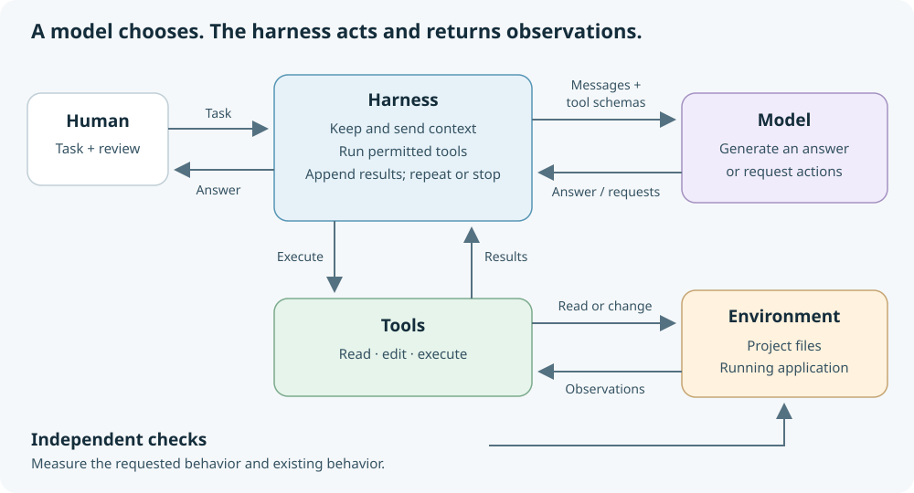

# Agent components

A coding agent combines a model with a harness that supplies context and carries out actions. The model proposes a next step; ordinary Python functions perform the file or command operations.

The harness sends messages and tool schemas to the model. It receives an assistant answer or structured requests, executes permitted tools, then adds their results to the next request. A schema describes a capability; a registry maps its name to a local function.

There are two loops: the human conversation waits for another task and retains history; the inner tool loop can take several actions for that one task. An answer without tools ends the turn. A step limit bounds the work. Independent checks determine whether the requested result was achieved.

The browser workbench provides an editor, Terminal and app preview. The agent runs in Terminal; the environment it works on contains the target project's files and running application.

## PEAS connection

- **Performance:** independent checks of the requested result and preserved behavior.
- **Environment:** the local project and runtime.
- **Actuators:** file changes and command execution.
- **Sensors:** file contents, errors and command results returned to the conversation.

The supplied approval wrapper gates shell commands and web fetching. File reads and edits are not gated. Choosing a project directory changes the working directory; it does not isolate the Python process.

Continue with the [first lesson](../tasks/01-first-call.md) or use the [command reference](cheatsheet.md).
