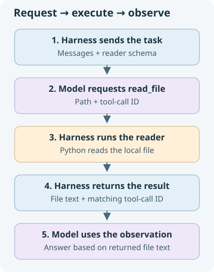

# Give the model a file reader

**12 minutes.** Investigating a project means finding out what is in its files. We have a conversation now; let's see what evidence it gives the model about our local project.

## Ask about a local fact

**checkpoints/project_brief.md** is a small fictional release brief supplied for this exercise. It contains a fact we can check: the project's release name.

Before asking, predict: **what can the model know about this file from the messages it has received?** In the chat left running from the previous lesson, enter:

```text
Read checkpoints/project_brief.md. What is this project's release name?
```

Inspect the request preview and answer. Did we send file contents, or only a path in a question? The answer may ask you to paste the file, decline, or guess. Look at `chat_turn`: there is no file read and no `tools` argument in its SDK call.

Naming a file does not send its contents or connect the API to your disk. We need a way for the model to request an observation. Type **exit** to return to the shell.

## How a tool supplies that observation

A **tool** lets the harness supply a capability the model can request. For a file reader, there are three parts:

- A **schema** describes the tool's name, purpose and inputs to the model.
- A **Python function** performs the read on your computer.
- A **tool result** carries the returned text into the next model request.



The model proposes the action. Your Python harness executes it and supplies the observation. This will become PEAS's sensor: a way to inspect the environment. Later, editing and command tools will let the agent change code and run tests, so tools can supply actions as well as observations.

## Add the plain reader

Open **tools.py**. Complete `read_file(path)` by returning the file's UTF-8 text using the imported `Path`. Let file errors reach the caller; we will see how the harness reports them in the loop lesson.

<details>
<summary>Hint</summary>

`Path(path).read_text(encoding="utf-8")` returns a string. Return that string directly for now.

</details>

<details>
<summary>Copyable solution — replace the whole read_file function</summary>

```python
def read_file(path: str) -> str:
    return Path(path).read_text(encoding="utf-8")
```

</details>

Save, then select **Run code**. This supplied checkpoint asks the same release-name question and advertises your reader to the model:

```bash
uv run python -m checkpoints.stage2_one_tool
```

At the pause, read the proposed request. **Which Python function will execute, with which path?** Predict its result, then press **Enter**. Inspect the returned file text and the model's answer. Compare the release name with the value actually read.

If the model answers without requesting the read, it has still received no file evidence; rerun the command and discuss that distinction with your instructor.

## Read the exchange

The checkpoint supplies a path-only schema like this:

```json
{"type":"function","function":{
  "name":"read_file",
  "description":"Read the complete UTF-8 contents of a known local file.",
  "parameters":{"type":"object","properties":{
    "path":{"type":"string"}
  },"required":["path"]}
}}
```

A model request might look like this; your actual ID can differ:

```json
{"role":"assistant","content":null,"tool_calls":[{
  "id":"read-1","type":"function","function":{
    "name":"read_file",
    "arguments":"{\"path\":\"checkpoints/project_brief.md\"}"
  }
}]}
```

`arguments` is a JSON string. The harness decodes it with `json.loads`, then calls your Python function. It appends the returned text with the **same ID**:

```json
{"role":"tool","tool_call_id":"read-1","content":"# Project brief\nRelease name: Cedar.\n..."}
```

This result is shortened for display here. In the real exchange, the next request includes the user task, the assistant's tool request and the matching result. The model can now answer from that observation. Merely printing the text would not send it back.

This checkpoint handles one exchange; it does not yet run a repeated agent loop.

**Quick question:** if the function reads the correct file but the result uses ID `read-2`, has it answered request `read-1` correctly?

<details>
<summary>Compare your answer</summary>

No. The result must be paired with the request's ID. The harness must append that matching result and include it in the next model call. Python performs the read; the model interprets the returned evidence.

</details>

Your agent can now obtain project evidence that was absent from the initial prompt. That is a capability it will need to investigate the task-board bug.

Optional reading: [OpenAI's tool-calling flow](https://developers.openai.com/api/docs/guides/function-calling#how-it-works).
