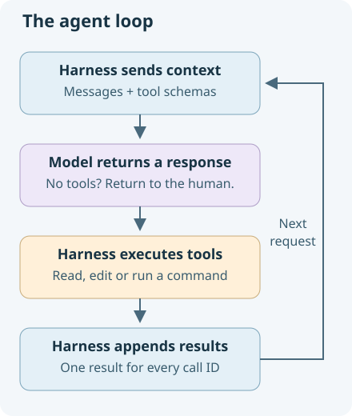

# Let the agent take several steps

**13 minutes.** Your reader can now choose which lines to return. Let's ask it to follow a reference: will one tool exchange be enough to collect the evidence?

## Follow a reference

The project brief points to a release decision in another file. Predict which observations the model will need, then try the task with our one-exchange checkpoint:

```bash
uv run python -m checkpoints.stage2_one_tool --paged \
  --prompt "Read checkpoints/project_brief.md. Follow its release-decision reference, then report the release name and decision with evidence."
```

Press **Enter** to allow each initial read. In the trace, match the requests to their results. **Is there a requested read with no returned observation?**

After sending the initial results back, this checkpoint ends. If the model requests another read, the trace marks it as unexecuted. Its choices can vary, so judge the evidence it actually obtained. A final answer cannot substitute for a missing file observation.

The reader can perform either action. The missing capability is in the harness: it needs to ask again and execute the next request. We will add that repetition now.



```text
send messages → assistant requests tools → execute → append results → send again
                         ↓ no tools
                   return to the human
```

The supplied outer chat loop waits for human input. The inner loop in `run_agent` can take several steps for that one request. A response without tool calls ends the turn; a maximum-step count also bounds the work.

## Fill three small gaps

Open **agent.py**. The SDK call, bounded loop, JSON decoding and exception handler are supplied. Complete the three marked gaps in `run_agent`:

1. **Stop:** after recording the assistant message, return `messages` if `msg.tool_calls` is empty or absent.
2. **Dispatch:** inside the supplied `try`, look up the function by `call.function.name`, invoke it with `**args`, and keep its result.
3. **Feedback:** append a `tool` message containing that result and the original `call.id`.

The supplied registry maps tool names to Python functions; JSON arguments are already decoded for you. Every request needs its own matching result before the next model call.

<details>
<summary>Hint</summary>

The assistant message must come before its tool results. Append the result outside the `try`/`except`, so a failed action produces feedback too. `if not msg.tool_calls` handles both `None` and an empty list.

</details>

<details>
<summary>Copyable answers — replace each marked raise line, including indentation</summary>

Gap 5A, inside the model-call loop:

```python
        if not msg.tool_calls:
            return messages
```

Gap 5B, inside the supplied `try`:

```python
                result = registry[call.function.name](**args)
```

Gap 5C, after the supplied `except`:

```python
            messages.append({
                "role": "tool",
                "tool_call_id": call.id,
                "content": result,
            })
```

</details>

## Try the assembled loop

With **agent.py** saved, select **Run code**. The supplied verbose display shows tool arguments and the returned file text, so you can inspect the observations that go back to the model. The reader's own output bounds still apply.

```bash
AGENT_VERBOSE=1 uv run python main.py
```

Use **Copy text** to paste the same task into the running agent:

```text
Read checkpoints/project_brief.md. Follow its release-decision reference, then report the release name and decision with evidence.
```

Watch the requested actions and returned observations. This time, a second tool request can be executed and its result returned to the model. Compare the final answer with the file evidence. The model may choose several reads in one reply or across multiple replies.

## Choose a follow-up

Take a minute to choose another question about the supplied project brief or release log. Before entering it in the running agent, predict the evidence needed. It may already have some of that evidence in this conversation.

For example, you could ask:

```text
The release note says Cedar is ready after acceptance checks pass. Do we actually have evidence that those checks passed? Explain what the files we have read establish and what is still unverified.
```

Compare the answer with the observations in the conversation. Did it obtain enough evidence, or would you ask it to inspect more? Your question may lead to different tools or a different sequence from your neighbour's.

<details>
<summary>What to look for</summary>

Line 180 states a condition: readiness depends on acceptance checks passing. It does not report their results. The project brief and release log contain no acceptance-check results, so they cannot establish that the checks passed. We would need results for the version we intend to release.

A relevant earlier result can be reused; a claim about unread content needs another observation. “We have not verified that yet” can be a useful answer. Judge whether the evidence supports the claim, rather than counting tool calls.

</details>

## Prepare for the repair

Your loop can gather evidence across several steps. To repair code, it also needs ways to act. Your improved reader is a sensor; the supplied registry adds:

- `list_files`: discover project paths.
- `str_replace` and `write_file`: change files. Replacement requires a unique match.
- `run_bash`: run a command and return its exit status and bounded output.

Those editing and command tools supply PEAS's actuators. They use the same dispatch and feedback code you just wrote.

The `system` message in **main.py** supplies instructions; project instructions are added when a project is selected. **ui.py** wraps command execution with a human approval prompt. Choose `y` to run a reviewed command or `n` to decline. A denial returns text to the model; the command does not run. Reads and edits are not gated in this teaching harness, and a project directory is not a security sandbox.

The exception handler turns a failed tool operation into `Error: ...` feedback, allowing another decision. Model-service errors still fail explicitly. Neither a denial nor a failed command counts as a successful check.

Your loop can now keep working on a task as observations arrive. Next, we will give it the repair ticket—and check its performance independently of its final answer.
