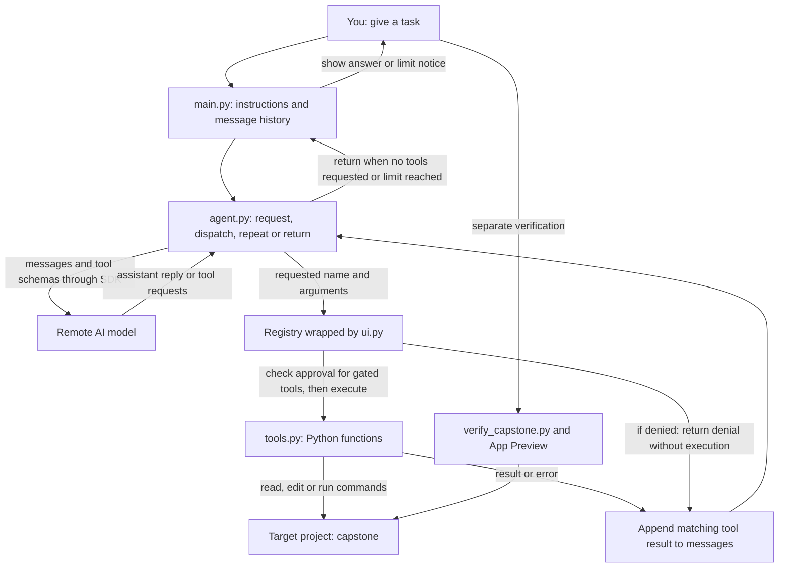

# Pedagogical gap review: learning to build a coding agent

Reviewed 25 September 2026.

**The workshop helps students complete a starter implementation, but does not yet give enough support for a first-time agent builder to reconstruct and explain the system independently.** The largest gaps are a concrete picture of the finished agent, a map connecting its components, and a worked explanation of the message/tool cycle before students implement it.

There is already a short overview, a component list, a sensible six-lesson sequence, hints, explanations and completion criteria. The problem is their depth, placement and connection. Adding more headings or more code exercises alone would leave that problem unresolved.

## Review basis

The assumed learner knows basic Python functions, dictionaries, loops and exceptions, as the [Welcome page][welcome] requires, but has never built a coding agent. This is different from assuming no programming experience. Agent concepts, message formats, tool dispatch and the distinction between model behavior and runtime behavior must be taught here.

I read Welcome, How it works, all three demo pages, all six active build lessons and the finish summary in the running browser workshop. I also inspected the corresponding lesson sources, student code, checkpoints, tests, workshop outline and facilitator guide. The active build sequence was checked against its [manifest][manifest]; old lesson redirects were not treated as current lessons.

For comparison, I read Vercel's course introduction and the lessons on the first agent, first tools, descriptions, system instructions, verification and sandbox interfaces, linked below. This is a review of those materials, not a claim to have completed all 38 Vercel lessons.

This is an expert walkthrough from a novice's perspective, not an observed learner study. Student questions below are illustrative. I did not complete the coding exercises, make live model calls or measure learner completion time. The recommendations are proposed teaching changes; this review does not implement them.

The existing [usability review][previous-review] records an earlier state. Current materials already address several of those findings. This review focuses on the remaining teaching gap rather than repeating old claims that onboarding, explanations or progress tracking are absent.

## What to retain

- The visible task-list bug and independent before/after checker give the project a concrete purpose.
- Four focused blanks make the coding workload manageable.
- One tool exchange precedes the general loop.
- Hints and solutions are separate disclosures, and recovery instructions preserve learner attempts.
- The lessons distinguish scripted examples, deterministic tests and live model behavior.
- The recovery lesson separates a denied action, a raised exception and a command that exits unsuccessfully.
- Completion is honestly described as a learner's own record. The browser finish page showed zero checked lessons after my reading-only walkthrough.

These are useful foundations. The next pass should connect them into a learning experience that explains why the program is shaped this way.

## What Vercel provides that is useful here

| Observed teaching pattern | Why it helps | Adaptation for this workshop |
| --- | --- | --- |
| The introduction names the finished product, describes its capabilities, lists prerequisites and explains the course progression. [Course introduction](https://vercel.com/academy/build-ai-agent-harness). | The reader can picture the destination and understand the learning contract before starting. | Describe our finished Python agent, its components and exactly which parts students implement. |
| The first lesson contrasts the same program without tools and with a file reader, including representative output and an explanation of the change. [From Chat to Agent](https://vercel.com/academy/build-ai-agent-harness/from-chat-to-agent). | A capability is connected to a visible limitation and a resulting behavior. | Compare the same local-file task before and after adding a tool. Keep observations qualified because live model replies vary. |
| Later tool lessons explain the remaining limitation, ask the learner to change descriptions and provide prompts to try the change. [Your First Tools](https://vercel.com/academy/build-ai-agent-harness/your-first-tools), [Descriptions That Work](https://vercel.com/academy/build-ai-agent-harness/descriptions-that-work). | Learners make a design decision and inspect its consequence. | Have students write and justify a description, then inspect a proposal. Our current comparison is mostly observation. |
| The instructions lesson distinguishes tool capability from behavioral policy and explains the purpose of individual prompt sections. [Structuring Agent Instructions](https://vercel.com/academy/build-ai-agent-harness/structuring-agent-instructions). | An otherwise hidden source of behavior becomes something the learner can reason about. | Explain our supplied system prompt and project instructions before students rely on them in the capstone. |
| Verification uses contrasting examples of vague and scoped reports. [Verification Gates](https://vercel.com/academy/build-ai-agent-harness/verification-gates). | Learners see the difference between a claim and evidence in concrete language. | Add one report-classification exercise to our already strong independent-checking workflow. |

The transferable pattern is **limitation → explanation → small change → visible consequence → reflection**. This does not require adopting Vercel's stack or its larger syllabus. Its [interface lesson](https://vercel.com/academy/build-ai-agent-harness/designing-the-interface) even explicitly identifies a stage that cannot yet run end to end: clarity about the current state matters more than promising that every intermediate file is runnable.

The component map and learner assessments proposed below are our recommendations; they are not claims that Vercel supplies those exact teaching aids or automated grading.

## Prioritized gaps

P0 means foundational material to address first. P1 means material needed before describing the workshop as independently usable by the intended learner. These are teaching priorities, not software incident severities.

### G1 · P0 · The destination is described, but not demonstrated

**Student question:** “What will the agent I build actually look like when it works?”

**Evidence:** [Welcome][welcome] promises an AI helper. [How it works][overview] lists components. The [opening demo][demo-app] shows the broken task-list app, and the next pages describe a tool request and a failing checker. None shows a complete agent carrying out a task before the learner begins building it.

**Consequence:** The student sees the application to repair more concretely than the program they are learning to build. They must imagine how a short Python loop becomes an agent that reads, edits and tests code.

**Close it:** Add a brief annotated demonstration of a completed agent inspecting and changing a separate tiny example, followed by an independent check. Label any prepared trace as scripted. Identify the learner's program, the remote model and the target application as three different things. Preserve the capstone's diagnosis as the learner's task.

**Acceptance:** Before editing, the student can describe the final input, actions and evidence, and distinguish the agent from the app it will repair.

### G2 · P0 · Components are listed without their relationships or ownership

**Student question:** “Where do these pieces live, what talks to what, and which ones am I writing?”

**Evidence:** The [overview's component list][overview] groups conversation history, schemas, registry, permissions, output limits and termination under what students will build. However, the [workshop outline][outline] says most of these are supplied. There is no component-to-file-to-lesson map on the guided introduction, and no architecture diagram connecting the list.

**Consequence:** A beginner cannot tell whether schema registration happens automatically, whether the model runs Python, or whether permissions are something their loop already enforces. The four blanks are an activity count, not a model of the system.

**Close it:** Add the map proposed below. Label components “implement,” “inspect” or “supplied.” Explain that we build selected core behavior by hand while using an SDK and supplied infrastructure. Keep this map available during lessons and highlight the current component.

**Acceptance:** The student can locate message state, model calls, dispatch, tool execution and approvals in the actual files, and explain which component owns each responsibility.

### G3 · P0 · There is no complete annotated message exchange

**Student question:** “What exactly goes into messages, and how does a requested function become a Python call?”

**Evidence:** The [tool demo][demo-tool] shows a simplified request containing a name and arguments. [Lesson 2][tool-lesson] identifies request/result IDs and asks learners to inspect a checkpoint. [Lesson 4][loop-lesson] requires dispatch and a tool-result message. There is no side-by-side walkthrough of the schema, assistant request, decoded arguments, function lookup, result and next model input.

**Consequence:** Students can reproduce the result dictionary without understanding why its role and ID matter. The simplified demo's arguments object also leaves a bridge to explain: the [loop scaffold][agent-code] decodes a JSON string with `json.loads`; students must then dispatch it using `**args`, as shown in the lesson's solution.

**Close it:** Walk through one small request using a table with columns for “who produced this,” “data,” “what Python does” and “what the model receives next.” Annotate `user`, `assistant`, `system` and `tool`; show that an assistant message can contain a tool request instead of a final answer. Explain `registry[name](**args)` using an equivalent ordinary function call.

**Acceptance:** Given shuffled messages, the student restores their order, matches a result to its request and explains why printing the result to Terminal does not send it to the model.

### G4 · P0 · The steps do not clearly show one program evolving

**Student question:** “Why am I moving between these files, and what changed from the previous version?”

**Evidence:** The path goes from [first_call.py][first-call-code] to a supplied [chat checkpoint][chat-code], then a supplied [one-tool checkpoint][one-tool-code], then [agent.py][agent-code] and [main.py][main-code]. The lessons have useful “Next” sentences, but do not map the shared operations between versions. Lesson 2 uses BLANK 3; lesson 4 uses BLANKs 1 and 2. The student loop's docstring still says Stage 5.

**Consequence:** A beginner may experience several separate examples instead of one accumulating mental model. They also encounter two loops without an explicit comparison: the outer conversation loop waits for the human; the inner agent loop takes tool steps for one human request.

**Close it:** Add a capability ladder and a small annotated comparison from one exchange to repeated exchanges. Identify what each checkpoint isolates, which student function it imports, and how it connects to the final entry point. Align stage and blank labels with the teaching sequence. Explain that a turn ending is different from a task being verified; the [BLANK 1 comment][termination-comment] currently says the task is done when no tool is requested.

**Acceptance:** The student can trace one human message through both loops and explain why another model call is needed after a tool result.

### G5 · P1 · Essential explanations appear after the task or behind disclosures

**Student question:** “Am I supposed to understand this already, or open a hint to learn it?”

**Evidence:** [Lesson 1][first-lesson] asks for an SDK call before explaining the request/response structure. [Lesson 2][tool-lesson] puts the definition of dispatch in a collapsed explanation after implementation and tracing. [Lesson 4][loop-lesson] asks students to fill both blanks before its explanation of message ordering. Browser inspection confirmed these explanations start collapsed.

**Consequence:** Hiding solutions is useful; hiding the reasoning needed to attempt the problem makes ordinary learning look like asking for help. Running tests first also assumes students can interpret a pytest failure, which is not among the stated prerequisites.

**Close it:** Put a short explanation and worked example in the normal reading path before the exercise. Keep hints, deeper detail and solutions collapsed. Before the first test command, annotate one failing assertion and one passing summary. In the loop lesson, teach stopping, one dispatch and repeated feedback as small successive steps.

**Acceptance:** A learner can attempt the exercise using the visible teaching, with hints helping them apply it rather than introducing an unexplained prerequisite.

### G6 · P1 · Supplied behavior becomes important before it is understood

**Student question:** “I wrote a reader and a loop. Where did editing, project rules and permission prompts come from?”

**Evidence:** The [tool implementation][tools-code] contains six tools. The core exercise implements only the reader. The [entry point][main-code] adds a system prompt, loads project instructions and wraps tools with approvals. The [capstone][capstone-lesson] briefly introduces AGENTS.md; inspecting its loader is suggested as later practice. The active lessons do not give the system prompt a comparable explanation.

**Consequence:** The capstone appears to gain abilities and policies through unexplained machinery. Students may conflate a description or instruction to the model with a rule enforced by Python.

**Close it:** Before the first full-agent run, give a short guided tour of the supplied pieces. Explain the purpose and a sample input/output of listing, reading, writing, exact replacement and command execution; mark web fetching as optional. Show where the system message is constructed and where the approval wrapper actually blocks execution. State explicitly that file-editing tools are not gated in this workshop, as the existing demo already notes.

**Acceptance:** For “prefer a file reader,” “decline a shell command” and “load project instructions,” the student identifies whether the behavior comes from model instructions or Python execution.

### G7 · P1 · Observation is not followed by enough independent practice

**Student question:** “Could I make a sensible change myself, or have I only watched the supplied example?”

**Evidence:** [Lesson 3][description-lesson] asks students to run two prepared descriptions, record choices and run fixed paging commands. It does not ask them to write a description or design a follow-up request. [Lesson 5][recovery-lesson] explains a prepared sequence. The core implementation stays at four blanks; later practice jumps to web fetching or an app feature.

**Consequence:** Learners can follow commands and see correct output without making the decisions the lesson claims to teach. The step from a fully scaffolded exercise to an independent extension is large.

**Close it:** Fade assistance in small increments: first explain an example; next complete part of a similar one; finally solve a small variation. Have students write a clearer description and justify a tool choice. For paging, give a new starting point and ask them to construct the next call. For recovery, ask them to classify an unseen result and propose a sensible next action before seeing an explanation.

**Acceptance:** The learner solves a comparable case with different inputs without copying the supplied answer. Assess the rationale separately from whether a live model happens to choose the expected tool.

### G8 · P1 · Completion evidence does not establish conceptual understanding

**Student question:** “My tests pass. How do I know my explanation is correct?”

**Evidence:** The [loop lesson][loop-lesson] combines passing tests with “you can explain” criteria. The [progress view][progress-view] records one self-confirmation per lesson. There are explanations to read, but no structured answer comparison for a new case and no cumulative reconstruction exercise. The [capstone][capstone-lesson] correctly requires independent application checks.

**Consequence:** Code correctness, task success and understanding can be mistaken for one achievement. A copied solution can pass tests; a passing repaired app does not show that the student understands dispatch.

**Close it:** Add one small concept check per lesson with an answer explanation, and a final explain-back using the component map. Keep free navigation and honest self-reporting. Record separately what code was checked, what the student can explain and whether a live agent attempt occurred; no grading platform is necessary.

**Acceptance:** The student explains a new trace, diagnoses a missing-result example and distinguishes an ended turn from a verified repair. They can report a live-model failure accurately even when their deterministic loop tests pass.

### G9 · P1 · The offline route skips an experiential foundation

**Student question:** “Without a key, how do I learn what the model receives before I start learning tools?”

**Evidence:** [Lesson 1][first-lesson] tells students without a key to read the explanation, move to lesson 2 and leave the lesson unchecked. Later scripted checkpoints are clearly labeled and useful, but there is no equivalent beginner exercise assembling conversation history before tool messages are added.

**Consequence:** The offline learner's first practical encounter with the protocol is already a tool exchange. They lose the simpler baseline needed to understand it.

**Close it:** Provide a paper or local scripted exercise that builds the message list across two human turns and a restart. Let the learner inspect exactly what would be sent. Label conceptual work as complete separately from the unattempted live call. This can be a short annotated transcript; it need not add infrastructure.

**Acceptance:** With no provider access, the learner can still construct the next request and explain which prior information it contains. Live model access remains a distinct, honestly unverified outcome.

### G10 · P1 · The assumed workload exceeds the visible prerequisite bridge

**Student question:** “Am I learning agents, Python testing, web requests or server operations right now?”

**Evidence:** [Welcome][welcome] requires basic Python and copying commands. The [demo][demo-app] immediately introduces server startup, curl, ports, background processes and JSON. The [capstone hints][capstone-hints] introduce PATCH, GET and Pydantic. The [schedule][outline] allocates only 15 minutes to both tool lessons together and 15 minutes to the repair, while correctly acknowledging that timings are unvalidated.

**Consequence:** Too many unfamiliar ideas compete with the agent model. The independent repair route without a key is especially demanding because it requires students themselves to understand the supplied web application.

**Close it:** Keep setup separate from learning time. Add just-in-time primers for JSON, dictionary argument expansion, test output and the task app's browser → API → stored-task relationship. Make clear which supplied server code students only need to operate. Reuse the recorded demo baseline instead of repeating all setup instructions in the main capstone path. Put extra live experiments and web fetching on an extension path, then pilot the core before confirming its duration.

**Acceptance:** Students can explain why a refresh exposes this bug and what each checker proves without needing an unscheduled introduction to web frameworks. Measure time spent on setup, Python syntax, agent concepts and app diagnosis separately.

## The missing overview, made concrete

The opening should give students something like this before any blank:

> You will build the core of a Python coding agent that runs in the Terminal. Give it a task in plain English. A model can then request actions such as reading a file, changing code or running a test. Your Python program executes those actions and sends back the results, allowing the model to choose another action or answer. At the end, you will use the agent to repair a supplied task-list app and check the repair yourself. You will implement the first model call, a file reader and two parts of the loop. The other tools, interface, approval checks and application checker are supplied and explained along the way.

This proposed map shows the completed agent's intended flow, based on the current scaffold and supplied implementations:

The model receives descriptions and schemas; the registry stays in Python. A function's result reaches the model only through a later request. A returned answer or an exhausted iteration limit says nothing by itself about whether the target app is repaired.

| Piece | Purpose | Learner's role | Where it enters the course |
| --- | --- | --- | --- |
| [first_call.py][first-call-code] | Make a single request using the SDK. | Implement one call; understand inputs and response. | Lesson 1 |
| [main.py][main-code] | Collect human input, retain messages, supply instructions and connect the pieces. | Inspect supplied integration. | Map at the start; explain again before full-agent use. |
| [agent.py][agent-code] | Ask the model again after tool feedback; stop or return control. | Implement termination and dispatch/result feedback. | Lessons 2 and 4 |
| [tools.py][tools-code] | Describe tools, map names to functions and execute operations. | Implement read_file; inspect supplied schemas, registry and other tools. | Lessons 2–3, then a tour before the capstone. |
| [ui.py][approval-code] | Display activity and intercept gated tools for permission. | Inspect supplied behavior and distinguish denial from execution. | Lesson 5 |
| [checkpoints][one-tool-code] and [tests][loop-tests] | Isolate concepts and check Python behavior with prepared inputs/replies. | Predict, trace, run and explain. | Throughout |
| [capstone app][app-code] and [independent checker][checker-code] | Supply a real repair target and evidence about its behavior. | Observe the bug, attempt repair, verify independently. | Demo and lesson 6 |

The browser editor, Docker environment and preview host these activities. They are not the agent's intelligence or additional components students need to build. Redis persistence and multiple agents remain follow-on topics, as the [workshop scope][scope] already specifies.

## A consistent lesson structure

Use the existing six lessons, with this teaching sequence inside each one:

1. **Recall and locate:** what already works; the relevant part of the component map.
2. **Encounter a limitation:** a concrete task the current version cannot yet handle.
3. **Explain and demonstrate:** a small worked example, including the data that crosses each boundary.
4. **Predict and implement:** a focused decision, then the smallest relevant change.
5. **Observe and interpret:** expected evidence, one common failure and why the result occurred.
6. **Apply with less help:** one changed input or small variation.
7. **Explain back and continue:** an answerable concept check, an explanation to compare against and the limitation motivating the next lesson.

This replaces disconnected explanation and repeated operational text; it should not simply add more reading to every existing page.

| Lesson | Main conceptual outcome | Example evidence of understanding |
| --- | --- | --- |
| 1. Model call and conversation | Context is information our program sends. | Assemble the second request, then show what changes after restart. |
| 2. One tool | Request, execution and feedback are separate events. | Match a schema, request, Python call and result. |
| 3. Descriptions and context | Descriptions guide selection; bounded output requires explicit continuation. | Write a description, justify a choice and construct the next page request. |
| 4. Repeated steps | Results change the next request; the human loop and tool loop do different jobs. | Trace two rounds and diagnose a missing-result message. |
| 5. Recovery and approvals | A denial, an exception and a failed process convey different evidence. | Classify an unfamiliar result and propose the next useful action. |
| 6. Repair and verification | The agent's claim, runtime checks and application correctness are separate. | Explain a retained trace and give a scoped report backed by unchanged checks. |

## Recommended work order and validation

| Order | Concrete deliverable | Gaps addressed | Ready when |
| --- | --- | --- | --- |
| 1 | Opening outcome demonstration, component map and implement/inspect/supplied table. | G1–G2 | A new reader can explain the destination and locate its parts before coding. |
| 2 | Annotated message exchange, one-exchange-to-loop comparison, consistent stage labels and visible prerequisite explanations. | G3–G5 | The learner can trace the data and attempt dispatch without first opening the solution. |
| 3 | Supplied-tool/system-prompt tour, small independent exercises, answer explanations and offline history exercise. | G6–G9 | Learners can solve an unseen small variation on either access route. |
| 4 | Short capstone primer, reduced repeated setup and a timed learner pilot. | G10; verify all others | Learning and operational problems are recorded separately and the schedule reflects observed work. |

Pilot with at least two Python-capable learners who have never built an agent, ideally including one using the offline route. Give them the student path without extra instructor explanation, and record where help becomes necessary. A small pilot identifies problems; it is not enough to establish general effectiveness.

Before their first coding exercise, ask them to describe the finished system. Before the loop lesson, ask them to order a tool exchange. After it, ask them to explain both loops and find a missing result. At the end, ask them to reconstruct the component map and explain their repair evidence. Record time, misconceptions, hint use and copied solutions alongside passing tests.

The completion criterion for the redesign should be: **a first-time agent builder can explain, trace and make a small independent change to the agent they built.** Running the prescribed commands remains necessary, but cannot be the sole evidence of that learning.

[welcome]: /Users/samuelagbede/Documents/Projects/redis-coding-agent/docker-workshop/frontend/public/welcome.md:14
[overview]: /Users/samuelagbede/Documents/Projects/redis-coding-agent/docker-workshop/frontend/public/review.md:4
[manifest]: /Users/samuelagbede/Documents/Projects/redis-coding-agent/docker-workshop/frontend/public/build-steps/manifest.yaml:1
[previous-review]: /Users/samuelagbede/Documents/Projects/redis-coding-agent/docs/research/self-guided-usability-review-2026-09-25.md:1
[demo-app]: /Users/samuelagbede/Documents/Projects/redis-coding-agent/docker-workshop/frontend/public/demo-steps/loop.md:16
[demo-tool]: /Users/samuelagbede/Documents/Projects/redis-coding-agent/docker-workshop/frontend/public/demo-steps/tools.md:5
[outline]: /Users/samuelagbede/Documents/Projects/redis-coding-agent/WORKSHOP.md:13
[first-lesson]: /Users/samuelagbede/Documents/Projects/redis-coding-agent/docker-workshop/frontend/public/build-steps/01-first-call.md:6
[tool-lesson]: /Users/samuelagbede/Documents/Projects/redis-coding-agent/docker-workshop/frontend/public/build-steps/02-one-tool.md:50
[description-lesson]: /Users/samuelagbede/Documents/Projects/redis-coding-agent/docker-workshop/frontend/public/build-steps/03-descriptions-and-context.md:12
[loop-lesson]: /Users/samuelagbede/Documents/Projects/redis-coding-agent/docker-workshop/frontend/public/build-steps/04-agent-loop.md:12
[recovery-lesson]: /Users/samuelagbede/Documents/Projects/redis-coding-agent/docker-workshop/frontend/public/build-steps/05-recovery.md:9
[capstone-lesson]: /Users/samuelagbede/Documents/Projects/redis-coding-agent/docker-workshop/frontend/public/build-steps/06-capstone.md:46
[capstone-hints]: /Users/samuelagbede/Documents/Projects/redis-coding-agent/docker-workshop/frontend/public/build-steps/06-capstone.md:70
[first-call-code]: /Users/samuelagbede/Documents/Projects/redis-coding-agent/docker-workshop/student/first_call.py:1
[chat-code]: /Users/samuelagbede/Documents/Projects/redis-coding-agent/docker-workshop/student/checkpoints/stage1_chat.py:1
[one-tool-code]: /Users/samuelagbede/Documents/Projects/redis-coding-agent/docker-workshop/student/checkpoints/stage2_one_tool.py:17
[agent-code]: /Users/samuelagbede/Documents/Projects/redis-coding-agent/docker-workshop/student/agent.py:27
[termination-comment]: /Users/samuelagbede/Documents/Projects/redis-coding-agent/docker-workshop/student/agent.py:45
[main-code]: /Users/samuelagbede/Documents/Projects/redis-coding-agent/docker-workshop/student/main.py:26
[tools-code]: /Users/samuelagbede/Documents/Projects/redis-coding-agent/docker-workshop/student/tools.py:139
[approval-code]: /Users/samuelagbede/Documents/Projects/redis-coding-agent/docker-workshop/student/ui.py:103
[loop-tests]: /Users/samuelagbede/Documents/Projects/redis-coding-agent/docker-workshop/student/tests/test_agent.py:1
[progress-view]: /Users/samuelagbede/Documents/Projects/redis-coding-agent/docker-workshop/frontend/src/views/Build.vue:50
[app-code]: /Users/samuelagbede/Documents/Projects/redis-coding-agent/docker-workshop/student/capstone/app.py:1
[checker-code]: /Users/samuelagbede/Documents/Projects/redis-coding-agent/docker-workshop/student/verify_capstone.py:1
[scope]: /Users/samuelagbede/Documents/Projects/redis-coding-agent/WORKSHOP.md:68
